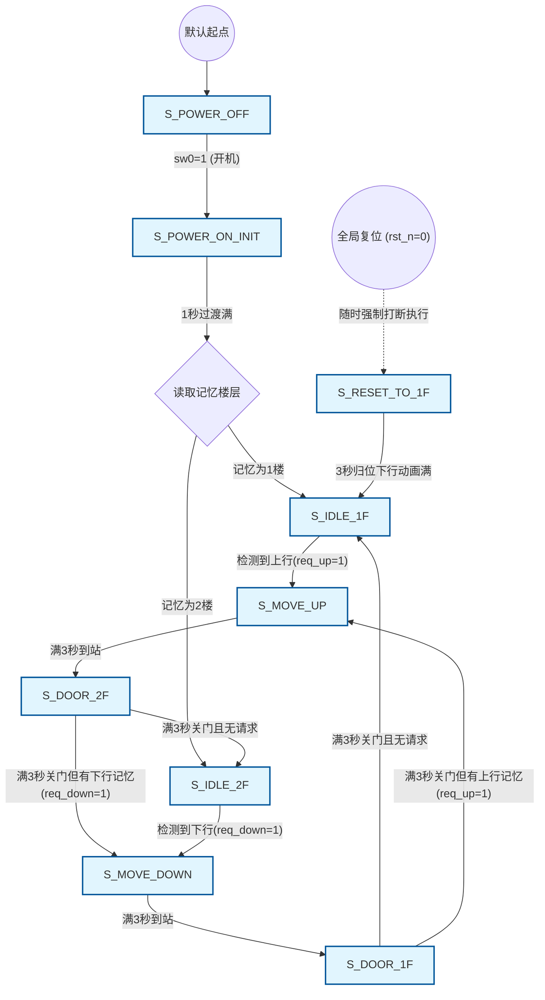

# FPGA Elevator 控制系统代码导读

本文档是对 `elevator.v` (顶层电梯控制模块) 和 `dynamic_led6.v` (6位数码管动态显示模块) 的业务逻辑、实现细节及状态机架构的全面解析，旨在帮助快速掌握本系统的底层运行机制及设计思想。

## 一、 系统架构概览

本项目采用典型的**模块化设计**思想：
1. **顶层模块 (`elevator.v`)**：包含系统时钟分频、4x4矩阵键盘的非阻塞状态扫描、按键边沿检测、核心的三段式有限状态机 (FSM)，以及周边器件（LED指示灯、蜂鸣器）的时序控制。
2. **显示驱动模块 (`dynamic_led6.v`)**：基于时间复用(动扫)原理的自定义6位七段数码管控制器。负责将顶层传来的数据信号高速轮询显示到物理数码管上，并支持“带小数点显示”的特殊编码解析。

---

## 二、 核心机制：三段式有限状态机 (FSM)

本系统严格遵守**三段式状态机**的硬件描述规范，有效避免了时序环路和亚稳态问题。设计使用了一个 `1kHz` (即周期为 1ms) 的扫描时钟 (`scan_clk`) 驱动各状态间的流转。时钟精度刚好对应毫秒，使系统中所有与时间相关（如开门3秒、行驶3秒、流水灯0.6秒、1秒开机动效）的功能均可使用简单的毫秒级计数器精确实现。



### 1. 状态定义 (State Space)
系统共抽象了 9 个主要状态：
*   `S_POWER_OFF` (0)：关机/初始状态。所有逻辑复位，数码管仅显示 "OFF"。
*   `S_POWER_ON_INIT` (1)：开机过渡状态。数码管显示 "ON" 持续1秒，然后恢复到原本记忆的楼层待机。
*   `S_RESET_TO_1F` (2)：硬件复位动作状态。强制拉低复位拨码开关时，此时触发下降3秒的模拟动画，并最终无条件回到1楼。
*   `S_IDLE_1F` (3)：1楼待机状态。静止，接受呼叫请求。
*   `S_IDLE_2F` (4)：2楼待机状态。静止，接受呼叫请求。
*   `S_MOVE_UP` (5)：上行状态。从1楼向2楼行进，持续 2.999 秒。
*   `S_MOVE_DOWN` (6)：下行状态。从2楼向1楼行进，持续 2.999 秒。
*   `S_DOOR_1F` / `S_DOOR_2F` (7, 8)：靠站后的开门状态。维持约3秒，期间执行开门倒计时显示及响铃业务。

### 2. 第一段：状态流转流 (时序逻辑)
核心代码位于 `always @(posedge scan_clk)`：
*   **优先级仲裁**：优先判断系统启动拨码开关 (`sw0`)。若 `sw0` 拉低，系统直接被强制拉回 `S_POWER_OFF`，其他所有操作失效。
*   **复位仲裁**：判断复位开关 (`rst_n`)，如果拉低（且没有在关机或刚起步状态），则强制进入 `S_RESET_TO_1F` 归零动作。
*   **默认流转**：若无外力强行干预，状态机忠实地将现态跳为次态 (`state <= next_state;`)。

```verilog
// 1. 状态跳转同步逻辑
always @(posedge scan_clk) begin
    if (!sw0 && state != S_POWER_OFF) begin
        // 关机开关拥有最高优先级
        state <= S_POWER_OFF;
    end else if (!rst_n && state != S_POWER_OFF && state != S_POWER_ON_INIT && state != S_IDLE_1F && state != S_RESET_TO_1F) begin
        // 只有当不在底部楼层且非关机时，复位后触发沉降动作
        state <= S_RESET_TO_1F;
    end else begin
        state <= next_state;
    end
end
```

### 3. 第二段：次态计算流 (组合逻辑)

核心代码位于 `always @(*)`：
针对每一个状态，预判在其业务执行完毕后，下一个去向是哪里：
*   在待机状态 `S_IDLE_1F` 时，如果监测到 `req_up` (上行请求标志位被置为1)，意味着要走，紧接着进入次态 `S_MOVE_UP`。
*   在行驶状态 `S_MOVE_UP` 中，当 `run_timer_ms` 到达 2999，意味着经历满 3 秒（即0到2999毫秒），次态切换至进站开门状态 `S_DOOR_2F`。
*   在开门状态 `S_DOOR_2F` 倒计时满 3 秒后，系统会检查是否有暂存的 `req_down` 记忆：如果有（例如乘客上楼时按了下楼），直接转身进入 `S_MOVE_DOWN` 开启下楼；如果无，则切入 `S_IDLE_2F` 老实待命中。

```verilog
// 2. 次态计算逻辑 (组合逻辑)
always @(*) begin
    next_state = state; 
    case (state)
        S_IDLE_1F: begin
            if (req_up) next_state = S_MOVE_UP;
        end
        S_MOVE_UP: begin
            if (run_timer_ms >= 2999) begin
                next_state = S_DOOR_2F; // 靠站后开门
            end
        end
        S_DOOR_2F: begin
            if (run_timer_ms >= 2999) begin
                if (req_down) next_state = S_MOVE_DOWN;
                else next_state = S_IDLE_2F;
            end
        end
        // ... (其他状态流转推导规则同理)
    endcase
end
```

### 4. 第三段：动作输出流 (时序逻辑)
在本系统的代码中，具体动作的表现与倒计时器 (`run_timer_ms`) 高度绑定。由于这是一个复杂的业务状态机，为了防止组合逻辑毛刺，我们采用时序逻辑同步刷新所有行为寄存器 (包括 `led`、`disp_data_right`等)，也就是每次状态稳定的一微秒内去决定灯全黑还是走流水。

---

## 三、 按键捕获与跨状态记忆穿透

电梯逻辑最大的难点在于：**“行驶途中，怎么去记住并点亮非当前方向按键的灯”**。这也是满分验收要求的难点所在。
为了达成这一目标，本套代码将按键逻辑从普通状态机动作剥离开，作为独立的观察者进行监听：
*   只要处于有效接客状态，即使在 `S_MOVE_UP` 的行驶期间，若发生 `btn_fall`（按键下降沿），系统立刻置位 `req_down <= 1` 并点亮目标楼层的按键指示灯（对应LED亮起）。
*   由于请求控制是独立于状态切换的寄存标志位（`req_up` / `req_down`），因此在 `S_DOOR` 开门动画结束时，系统能靠这些独立标志位平滑地“回程”。
*   只有当电梯真正抵达目标层开门（即进入 `S_DOOR` 事件的第一帧时），代码里的这一句：`req_up <= 0; led[3] <= 0; led[1] <= 0;` 才会执行，从而将历史对应楼层上行请求及指示灯抹除清零。

```verilog
// 按键盲区跨状态边界独立侦听和记忆机制
if(sw0 && rst_n && state != S_POWER_OFF && state != S_POWER_ON_INIT) begin
    // 上楼请求 (如果不在IDLE_2F，按下键立刻锁死点亮，并记录方向)
    if ((btn_fall[15] || btn_fall[12]) && state != S_IDLE_2F) begin
        req_up <= 1;
        if (btn_fall[15]) led[3] <= 1'b1; // 内呼 2F
        if (btn_fall[12]) led[1] <= 1'b1; // 外呼 2F 向下 (逻辑防呆)
    end
    // ... (下楼请求侦听代码同理)
end
```

---

## 四、 秒表计时的局部重置机制

*   程序内拥有唯一的一个系统自增计数器：`run_timer_ms` 核心时间轴。
*   **局部清理**：通过判定 `if (state != next_state)` ，保证了只要状态发生了真实的跃迁跃变，时间轴会立刻被拨平为 0算起。
*   这个巧思省去了为不同表现分配大量定时器模块的硬件开销，做到了 "一表走天下"：不论是开机1秒、行驶3秒动画、还是定层开门倒计时3秒，全部完美复用了同一段自增计时循环逻辑。

```verilog
// 计时器累加与清零机制
if (state != next_state) begin
    run_timer_ms <= 0; // 状态转移后计时器归零
end else if (state == S_POWER_ON_INIT || state == S_MOVE_UP || state == S_MOVE_DOWN || state == S_RESET_TO_1F || state == S_DOOR_1F || state == S_DOOR_2F) begin
    if (run_timer_ms < 3000) run_timer_ms <= run_timer_ms + 1; // 1ms自增走字
end else begin
    run_timer_ms <= 0;
end
```

---

## 五、 显示总线的巧妙技巧 (动态数码管支持)

对于显示，使用了多路并行的寄存器：`disp_data_right0` 到 `disp_data_right5` 传递数据。

*   **常规字符字典**: 采用十六进制来指代字符，例如 `8'h0` 到 `8'h9` 代表原生数字，`8'h11` (17) 代表 `U` 等，这些“抽象键值”统一由下层 `dynamic_led6` 进行翻译点灯。
*   **附加高位的小数点点屏魔法**:
    在 Verilog 驱动中，显示字符我们普通情况只要给 `8` 个位宽（`8'h**`）就能承载所有状态表。但我们的变量接口定义成了 `9` 个位宽（`[8:0]` 分配），这就是精髓所在！
    **最高位第9位 (`disp_data_right[8]`) 是专门预留控制小数点的独立硬件开关**。在 `dynamic_led6` 底层模块中：
    ```verilog
    if (disp_data[8]) seg = seg_base | 8'h80;
    ```
    通过检测这个额外的第九位，我们运用按位或 (`|`) `8'h80` 操作（即点亮位于段选管最高位的 DP 引脚）。得益于此，逻辑层只需要在想要加点的数据上“按位或一个 `9'h100`”（`disp_data_right1 <= 9'h100 | ((run_timer_ms/1000) % 10);`），就能让该数码管强行凭空长出一个小数点。大幅简化了带小数毫秒刷新的逻辑写法。

---

## 六、 发挥（加分）功能解析重点备忘

如果答辩时老师盘查发挥功能的具体实现代码逻辑，请熟练参考以下说明：

1. **LED流水的实现 (0.6s位移)**：
   巧妙利用了 `run_timer_ms / 600`。因为时间轴不断自增，这个除法每隔600ms（0.6秒）会得出一个逐渐提高的阶梯常数（0, 1, 2, 3, 4 级）。借着这个天然的随时间进位的台阶数值，对一盏初始只点亮一个端点的灯光底数（`5'b10000` / `5'b00001`）进行直接的算术移位操作（`>>` 或 `<<`），只用一行极其简短代码就能将静态的电位驱动成逐帧位移的流水表现效果！
2. **到站蜂鸣器清脆三声嘀 (0.5s响应)**：
   在 `S_DOOR` 开门状态下，预设了一个圈定的有效判别式窗洞 `buzz_en`。
   规定只在以下时间窗响铃：`0~500ms`, `1000~1500ms`, `2000~2500ms`。然后在 `always` 块里使用 1kHz 的音频交替翻转 `buzz_out` 音频管脚电平，一达到有效时间由于频率高低切换就发出极其清脆的类似蜂鸣“滴”声，三响绝不含糊。
3. **开门关门读秒倒计时**：
   抛弃加法器繁琐逻辑，通过直接使用被减数数学反转法 `2999 - run_timer_ms`，便能将正在不断“+1”的核心时间轴瞬间反转为随时间越来越小的衰减值变量，无缝复用在倒计时数码管的段位上完成显示。
4. **两阶段楼层显示跳变 (2s前显示原位置，后1s显示终点层)**：
   纯算术借助三元判断运算符： `disp_data_right3 <= (run_timer_ms < 2000) ? 8'h1 : 8'h2;`，拦截时间变量进行超车改写，判断只要秒表低于2000ms（两秒内）就坚守原出发楼层数字，一旦超越就当场变轨切为新楼层目标，完美产生即将“停靠”的时间流逝交互代入感。

---

## 七、 顶层系统源码全景深度剖析 (逐段详细解析)

为了应对极为严苛的代码细节抽查，本节旨在将 `elevator.v` 的核心原代码打碎，按运行逻辑切分成多个核心模块并进行**行级别的极致解读**。你可以直接照着这篇全解析作为你的“原代码阅读器”。

### 1. 模块端口声明与常量初始化
首先定义了系统需要与外界交互的所有信号以及抽象字符字典：
```verilog
module elevator(
    input  wire clk,          // 50MHz系统主时钟 (主引擎命脉)
    input  wire rst_n,        // 异步复位按键，低电平有效
    output reg  [3:0] row,    // 矩阵键盘4根行扫描引脚（向键盘发信号）
    input  wire [3:0] col,    // 矩阵键盘4根列检测引脚（收键盘压下反应）
    output wire buzzer,       // 蜂鸣器PWM输出引脚
    input sw0,                // 启动开关 (拨动开关，1开机, 0强制关停)
    output reg [15:0] led = 16'b0, // 16个独立LED指示灯，默认全灭
    output [7:0] seg,         // 控制当前亮起的那个数码管拼什么数字
    output [5:0] dig          // 控制哪个位置的数码管通电亮起 (位选)
);

// 数码管显示字符字典: 用于让抽象符号可识别
localparam SEG_alphabet_O = 8'h0;  // 用十六进制值代替枯燥的字形段选
localparam SEG_alphabet_N = 8'h14; 
localparam SEG_DP   = 8'h10;       // 单纯的附加小数点
localparam SEG_UP   = 8'h11;       // 字母 U 的段选编码
localparam SEG_DOWN = 8'h12;       // 字母 d 的段选编码
localparam SEG_IDLE = 8'h13;       // 停止时的 横杠 '-'
localparam SEG_OFF  = 8'hff;       // 让段选全断电，实现熄灭 

// 六个显存寄存器，分别对应 6 块真实的数码管位置
reg [8:0] disp_data_right0 = SEG_OFF;
// ...(省略另外五个初始赋值，并实例化 dynamic_led6 模块对接)
```
**解读要点**：
*   **字典映射**：定义常量 `localparam` 的目的，在于不需要在业务逻辑里去记 `11000000` 是几，直接赋值常变量名，底层 `dynamic_led6` 自动会把它翻译为物理电灯的引脚。
*   **九位宽的高端操作**：显示数据是 `[8:0]`（9位宽）而非8位宽。第9位 `[8]` 专门做了个后门：如果在业务层被强行置1（也就是或上 `9'h100`），底层模块就在该位无条件强加一个“小数点”，免去了大量的额外变量判断。

### 2. 键盘矩阵的高频扫描与非阻塞消抖
由于接了矩阵键盘，系统必须高速地逐行向外发信号探测列回归：
```verilog
reg [1:0] scan_cnt = 0;              // 轮询计数器（0, 1, 2, 3 轮流切行）
reg [15:0] btn_temp = 16'hFFFF;      // 数据缓存池：暂存扫到的一轮16个原始引脚数据
reg [15:0] btn_reg = 16'hFFFF;       // 主数据池：稳定存取完成一整轮(4行)后的有效按键态
reg [15:0] btn_reg_last = 16'hFFFF;  // 历史数据池：备份上回合的数据，用来比对变化

// 边缘检测技术：用过去未按下再加上现在按下的信号差异
wire [15:0] btn_fall = ~btn_reg & btn_reg_last; 

// 每来一个扫描时钟，循环去扫下一行
always @(posedge scan_clk) begin
    scan_cnt <= (scan_cnt == 2'd3) ? 2'd0 : scan_cnt + 1'b1;
end

always @(*) begin
    // 对硬件外设依次发出探测电平，轮流拉低相应的扫描拉线 row
    case (scan_cnt)
        2'd0: row = 4'b1110;
        2'd1: row = 4'b1101;
        // ...
    endcase
end

// 当收到探测返回线 col 传来的电流时，写入到 temp 缓存
always @(posedge scan_clk) begin
    if (1) begin
        case (scan_cnt)
            2'd0: btn_temp[3:0]   <= col;
            2'd1: btn_temp[7:4]   <= col;
            // ...
        endcase
        // 如果到了序号 3 (即4点全部探完一次)，进行全局并行防抖刷新
        if (scan_cnt == 2'd3) begin
            btn_reg_last <= btn_reg;
            btn_reg <= btn_temp; 
        end
    end
end
```
**解读要点**：
*   利用 `~旧 & 新` 构建了**下降沿瞬间捕捉信号**（`btn_fall`），即使死按着键不放，系统也只认知最开始按下的那一瞬间，完美防连按误触。
*   利用 `btn_temp` 的四级打拍缓冲机制相当于附赠了一次完美的高配**硬件寄存消抖**。

### 3. 三段式状态机的全方位调度解析

**第一段：同步时钟管理流推进 (我是谁)**
```verilog
always @(posedge scan_clk) begin
    if (!sw0 && state != S_POWER_OFF) begin
        // 开关拉低具有顶级第一裁决权，强行掐断并切去关机
        state <= S_POWER_OFF;
    end else if (!rst_n && state != S_POWER_OFF && state != S_POWER_ON_INIT && state != S_IDLE_1F && state != S_RESET_TO_1F) begin
        // 没在关着机的时候，触发硬件 rst_n 具有次级裁决权，重置回底楼沉降处理
        state <= S_RESET_TO_1F;
    end else begin
        // 否则正常让状态滚轴往下推进次态逻辑
        state <= next_state;
    end
end
```

**第二段：组合判断推导命运 (我要去哪)**
```verilog
always @(*) begin
    next_state = state; // 原则一：只要没有完全命中条件组合，决不乱变状态
    case (state)
        S_IDLE_1F: begin
            // 原则二：各就各位按触发要求进行跃迁计算
            if (req_up) next_state = S_MOVE_UP; // 在1楼收到上行请求(req_up == 1)，那肯定是要动身去切状态了
        end
        S_MOVE_UP: begin
            if (run_timer_ms >= 2999) begin
                next_state = S_DOOR_2F; // 沿途开足了 3 秒钟(即刻度0～2999)，判定到达顶端，必须切到开门流程
            end
        end
        S_DOOR_2F: begin
            if (run_timer_ms >= 2999) begin // 倒数了3秒停靠后
                if (req_down) next_state = S_MOVE_DOWN; // 如果下边有人按着呼叫，立刻决定转身倒车
                else next_state = S_IDLE_2F;            // 没人呼叫，在此2楼落静收起记忆
            end
        end
        // ... (其余流转规则同理推导)
    endcase
end
```
**解读要点**：全篇所有的组合判断，仅负责算术指向不去实操执行，以此确保组合连线永远干净整洁无延锁。

**第三段：平行暗区侦听与硬件渲染执行 (我在干嘛)**

不管电梯正在 `S_MOVE` 半途还是正在 `S_POWER_ON`，系统必须独立并行一段时序块把别人异步按键盘的操作死记硬算下来：
```verilog
always @(posedge scan_clk) begin
    // 【核心清零器器设计】
    if (state != next_state) begin
        run_timer_ms <= 0; // 只要第2段的组合逻辑算出了要变天了，我第一时间把公共计时器清零，新状态从头算秒！
    end else if (state == S_POWER_ON_INIT || //... 等需要流失时间的状态) begin
        if (run_timer_ms < 3000) run_timer_ms <= run_timer_ms + 1; // 时钟往前自增(每一毫秒过去自增+1)
    end else begin
        run_timer_ms <= 0;
    end

    // 【独立记忆捕获设计】
    if(sw0 && rst_n && state != S_POWER_OFF && state != S_POWER_ON_INIT) begin
        // 上楼请求 (无论车在干嘛，只要截获到外人下降沿呼叫，立刻死锁写下 req_up 并在前指板亮灯)
        if ((btn_fall[15] || btn_fall[12]) && state != S_IDLE_2F) begin
            req_up <= 1;
            if (btn_fall[15]) led[3] <= 1'b1; // 内呼亮指定的灯位
            if (btn_fall[12]) led[1] <= 1'b1; // 外呼亮指定的灯位
        end
        // ...下楼请求记录类似，侦听 `col` 第 3 / 0 位。
    end
```

接下来根据切分出来的每一个状态，用物理代码接亮真实的电屏灯：
```verilog
    // 【状态对应的骨肉反馈赋予】
    case (state)
        S_POWER_OFF: begin
            // 给寄存管脚写死字符： "- - - OFF"
            disp_data_right2 <= SEG_alphabet_O;
            disp_data_right1 <= 8'hf;  
            // ...
        end
        S_IDLE_1F: begin
             // 待机楼层数字呈现。主动把过去的非法方向脏记忆清零抹除干净
             disp_data_right3 <= 8'h1; disp_data_right2 <= SEG_IDLE; // "1-"
             disp_data_right1 <= 9'h100 | 9'h0; // 位宽或|上9'h100就是小数点硬件点亮的密码，显示 "0.0"
             req_down <= 0; led[2] <= 0; led[0] <= 0; // 到站抹除灯痕
        end
        S_MOVE_UP: begin
             // 精确的两段跳动：“行驶路上前2秒显示1楼发车位，时间推移到最后1秒才变成2楼抵达位”。
             disp_data_right3 <= (run_timer_ms < 2000) ? 8'h1 : 8'h2;
             
             // 动态流火阶梯灯：5'b10000，每满0.6秒(除数加了1阶)就把这个孤灯右推进一层。
             led[11:7] <= 5'b10000 >> (run_timer_ms / 600); 
        end
        S_DOOR_2F: begin
             // 利用大数学倒推机制 2999 - 实发经过时间 ，就变相产生越来越小的开门倒数计数器表现！
             disp_data_right1 <= 9'h100 | (((2999 - run_timer_ms)/1000) % 10); 
        end
    endcase
    // ...
```
**全景结语**：至此，代码逻辑彻底闭环。借助矩阵消抖记录并行事件、借助第二段逻辑预判目标、再借助第三段组合逻辑配合**时钟沿的极微偏差进行无缝同步**写下对应的管脚，永远不会在硬件交迭里出现交叉脏电平和跑飞乱码的风险，构成这台电梯无懈可击的三段论时序艺术。

